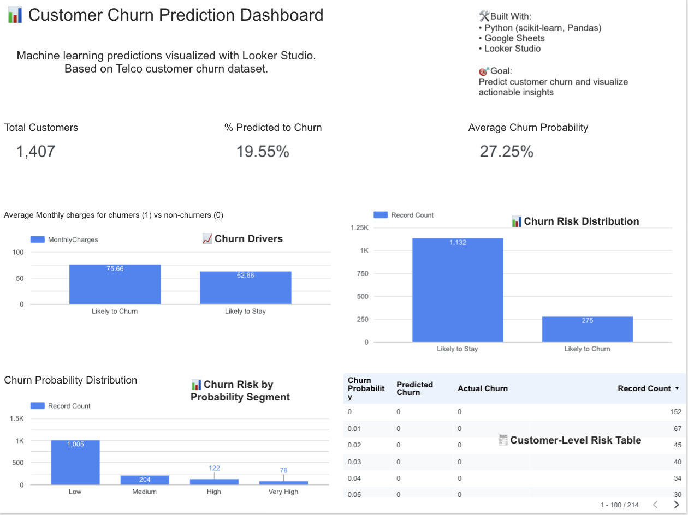
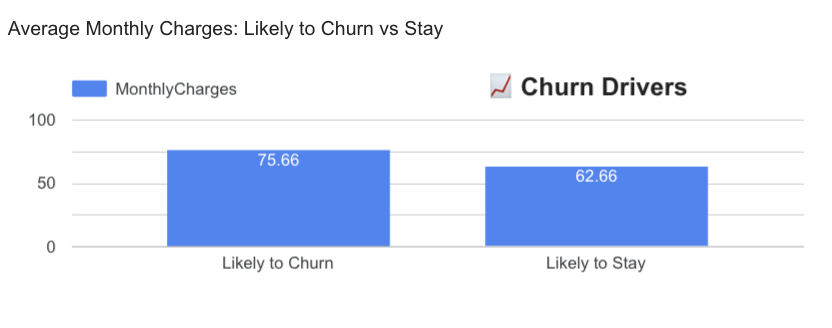
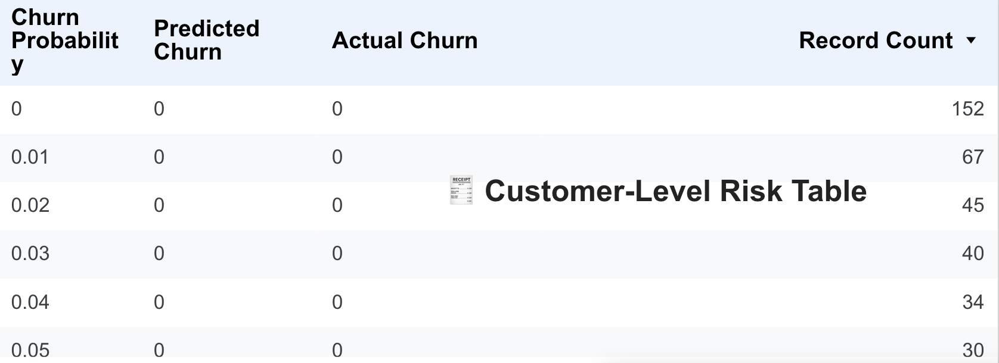

# 🧠 Customer Churn Predictor

A machine learning project that predicts which customers are most likely to churn — then visualizes those insights in a real-time business dashboard using Looker Studio.

---

## 🚀 Overview

Many businesses lose customers without knowing why — or who’s next. This project helps companies take action **before** it’s too late by:

- Training a machine learning model to predict churn
- Explaining which factors drive churn behavior
- Visualizing customer risk and patterns in an interactive dashboard

---

## 🛠 Tech Stack

| Layer         | Tools Used                                         |
|---------------|----------------------------------------------------|
| Data & Model  | Python (Pandas, scikit-learn, matplotlib, seaborn) |
| Data Output   | Google Sheets                                       |
| Visualization | Looker Studio                                      |
| Extras        | Jupyter Notebook, GitHub, Google Sheets API        |

---

## 📁 Project Structure
📂 customer-churn-predictor/
├── churn_model.ipynb          # Jupyter Notebook for EDA + ML model
├── churn_predictions.csv      # Model output: probabilities + predictions
├── 📊 Looker Studio Dashboard (link below)
└── README.md

---

### 💡 Key Features:
- Predicted churn rate, average churn probability, high-risk segments
- Top churn drivers like MonthlyCharges and Contract Type
- Risk-labeled table of individual customers

📸 *Screenshots:*

| Churn Overview | Churn Drivers | Risk Table |
|----------------|---------------|------------|
|  |  |  |

---

## 📈 Model Performance

- **Model used**: Random Forest Classifier  
- **Accuracy**: `78%`  
- **F1 Score**: 
    - Class 0 (Stayed): 0.86
    - Class 1 (Churned): 0.53
    - Macro Avg: 0.70
    - Weighted Avg: 0.77

---

## 🧠 Business Value

This project simulates how data teams can:
- Identify high-risk customers early
- Prioritize outreach or retention strategies
- Understand what’s driving churn at a glance

---

## ✅ Future Improvements

- Add SHAP values for model explainability
- Build Streamlit version for end-user inputs
- Automate Google Sheet + dashboard refresh

---

## 📌 Tags

`Data Science` `Churn Prediction` `Machine Learning` `Looker Studio` `Customer Analytics` `Retention` `Business Intelligence`